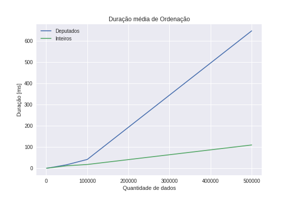
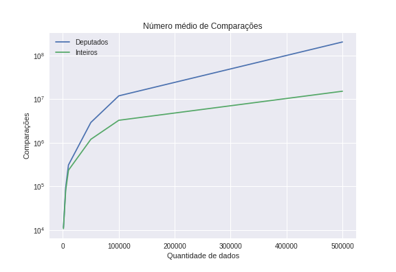
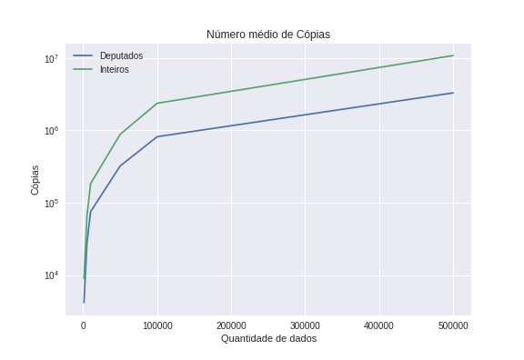

GastosDeputados

# Cenario 01 - Análise de Desempenho de ordenação pelo QuickSort

## Gráfico de tempo de duração

## Gráfico do número de comparações

## Gráfico do número de cópias

# Cenario 04 - Análise de Desempenho de métodos de resolução de colisões para inserção de tabelas Hashing

## Gráfico de tempo de duração

## Gráfico do número de comparações

## Gráfico do número de cópias

